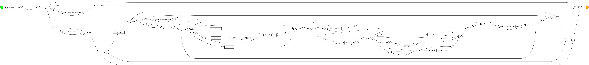

# BPI 2017 Process Mining Analysis

This repository contains a university praktikum project using Python and PM4Py to analyze the BPI Challenge 2017 event log. The project explores the event data, discovers process models, exports visual process representations, and evaluates model quality with standard process mining metrics.

## Project Overview

The analysis focuses on understanding the loan application process from the BPI Challenge 2017 dataset. It uses process mining techniques to move from raw event logs to interpretable process models and quality metrics.

## What This Project Does

- Loads the BPI Challenge 2017 event log with PM4Py
- Converts the event log into a pandas DataFrame for exploratory analysis
- Computes basic process statistics, including number of cases, events, variants, activities, and resources
- Calculates case length and case duration statistics
- Discovers process models using Inductive Miner and Heuristics Miner
- Exports process tree, Petri net, and BPMN visualizations
- Evaluates the discovered model using fitness, precision, generalization, and simplicity

## Technologies Used

- Python
- pandas
- PM4Py
- Process mining
- Event log analysis
- BPMN

## Repository Contents

```text
.
|-- README.md
|-- process_mining_analysis.py
|-- process tree.png
|-- process heuristics tree.png
|-- process_model.png
`-- process_model.bpmn
```

## Generated Outputs

### Process Tree


### Heuristics Miner Result


### BPMN Process Model



## Data Setup

The BPI Challenge 2017 event log is not included in this repository because of dataset size and licensing constraints.

To reproduce the analysis:

1. Download the BPI Challenge 2017 event log.
2. Place the `.xes.gz` event log file in a local data folder.
3. Update the `file_path` variable in the Python script so it points to the downloaded event log.

## Installation

Install the required Python packages:

```bash
pip install pandas pm4py
```

## How to Run

Run the analysis script:

```bash
python process_mining_analysis.py
```

The script prints summary statistics to the console and generates process mining visualizations such as the process tree, heuristics miner output, and BPMN model.

## Model Evaluation

The project evaluates the discovered process model with the following metrics:

| Metric | Meaning |
|---|---|
| Fitness | Measures how well the model can reproduce the observed event log behavior |
| Precision | Measures how much extra behavior the model allows beyond the event log |
| Generalization | Measures how well the model can represent unseen but likely behavior |
| Simplicity | Measures how simple and interpretable the model is |

## Learning Outcome

This project demonstrates how process mining can be used to analyze real event logs, discover business process models, and evaluate the quality of those models using quantitative metrics.
